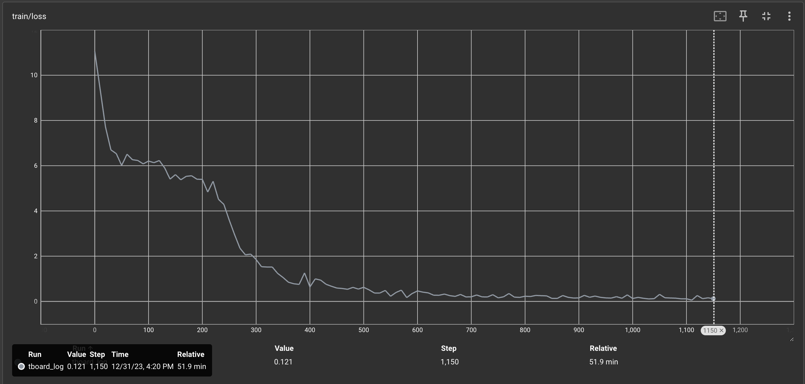

# `nanoGPT_mlx`

A port of Andrej Karpathy's [nanoGPT](https://github.com/karpathy/nanoGPT) in Apple's new machine learning framework, [MLX](https://github.com/ml-explore/mlx).

Train OpenAI's GPT-2 models or custom GPT-style models from scratch, all on your Mac's GPU!

Still under active development, but currently the file `train.py` closely resembles the nanoGPT codebase.

## install

Create a conda environment using the provided
   environment configuration file.

```bash
conda env create -f environment.yaml
```

Activate conda environment.
```bash
conda activate apple_mlx
```

Dependencies:
- [mlx](https://ml-explore.github.io/mlx/build/html/index.html)
- [numpy](https://numpy.org/install/)
-  `datasets` for huggingface datasets (if you want to download + preprocess OpenWebText)
-  `tiktoken` for OpenAI's fast BPE code
-  `tensorboardX` for optional logging
-  `tqdm` for progress bars

## quick start
To train a character-level GPT, prepare shakespeare dataset similar to nanoGPT. This will create a `train.bin` and `val.bin` in that data directory.
```bash
python data/shakespeare/prepare.py
```

Now, let's train a "baby GPT" model on your MAC GPU:
```bash
python train.py configs/train_gpt2_shakespeare.py
```

On my Macbook M3 Pro, I am observing `~0.37 iterations/second` when training a `~45M parameter` GPT-2 model, at `batch_size=64` (i.e., `local_batch_size=4` and `gradient_accumulation=16`).



## openwebtext
To train a GPT-2 model on OpenWebText similar to nanoGPT, first prepare the dataset:
```bash
python data/openwebtext/prepare.py
```

Then, train a 124M GPT-2 model on your MAC GPU:
```bash
python train.py configs/train_gpt2_owt.py
```

## todos
- disable weight decay on non-decay params in optimizer
- add bfloat16 training support
- integrate Eleuther Eval
- add checkpoint conversion for loading pre-trained models
- enable finetuning models from pre-trained checkpoints
- enable inference with pre-trained models

## acknowledgements
Thank you [Andrej Karpthy](https://github.com/karpathy) for creating the nanoGPT codebase. It's been awesome for quick prototyping!
